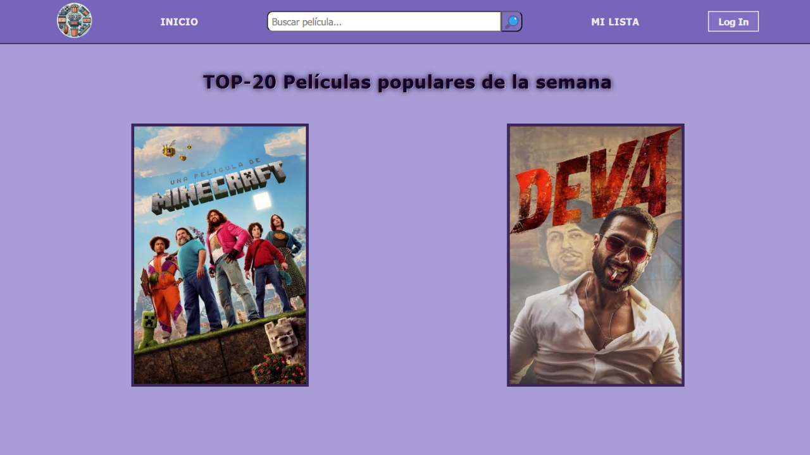
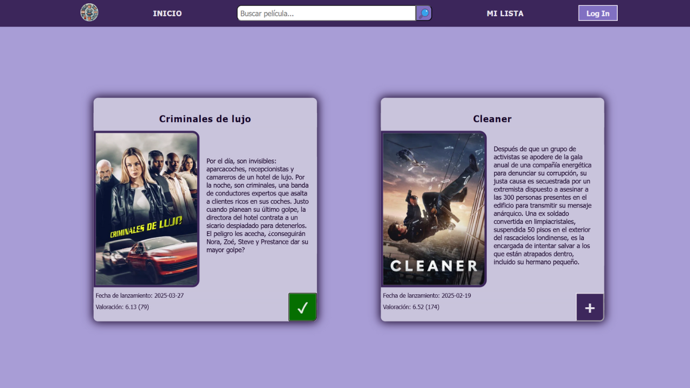
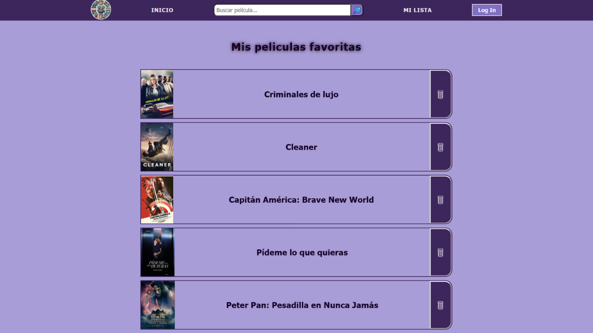

# 🎬 MovieLandia: Buscador de Películas

¡Bienvenido a **MovieLandia**!

👉 **[Ver la demo en producción](https://movie-landia.netlify.app/)**

Esta aplicación permite buscar información de películas utilizando la API de OMDB. Es ideal para practicar consumo de APIs.

## 📖 Descripción
Este proyecto fue desarrollado en **JavaScript**, usando la API pública de OMDB para obtener datos como título, año, tipo y afiche de películas.  
Es una app sencilla, ideal para aprender cómo conectar una app frontend con APIs externas.

## 🛠️ Tecnologías utilizadas
- JavaScript
- Fetch API
- HTML & CSS

## 🔍 Funcionalidades principales
- Buscar películas por título
- Visualizar los resultados con su imagen y detalles básicos
- Interfaz amigable y simple

## 📷 Capturas de pantalla
A continuación, algunas imágenes de la aplicación en funcionamiento:





## 🚀 Cómo ejecutar el proyecto
1. Clonar este repositorio:
   ```sh
   git clone https://github.com/Gherex/MovieLandia.git
   ```
2. Abrir el archivo index.html en tu navegador web.
¡Listo! Ya podés usar la aplicación.

## 💡 Nota
Este proyecto fue creado con fines educativos y para reforzar conceptos de desarrollo frontend y consumo de APIs.

## ✍️ Autor
**Germán Lagger**  
- [GitHub](https://github.com/Gherex)
- [LinkedIn](https://www.linkedin.com/in/germanlagger/)
